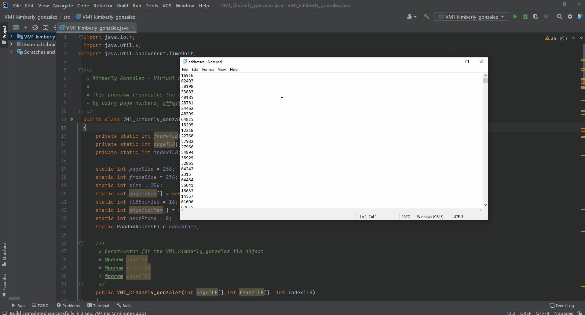

# VMM

This program translates the given logical addresses from the addresses.txt file into physical addresses. This is done by using page numbers, offests, frame number, TLB and a page table in order to fine the frames in physical memory.



## [Java file](https://github.com/kgonz038/VMM/blob/main/VM1_kimberly_gonzalez.java)

```java
import java.io.*;
import java.util.*;
import java.util.concurrent.TimeUnit;

/**
 * Kimberly Gonzalez - Virtual Memory Manager
 *
 * This program translates the given logical addresses from the addresses.txt file into physical addresses. This is done
 * by using page numbers, offests, frame number, TLB and a page table in order to fine the frames in physical memory.
 */
public class VM1_kimberly_gonzalez
{
    private static int frameTLB[];
    private static int pageTLB[];
    private static int indexTLB;

    static int pageSize = 256;
    static int frameSize = 256;
    static int size = 256;
    static int pageTable[] = new int[pageSize];
    static int TLBEntries = 16;
    static int physicalMem[] = new int[(size * frameSize)];
    static int nextFrame = 0;
    static RandomAccessFile backStore;

    /**
     * Constructor for the VM1_kimberly_gonzalez tlb object
     * @param pageTLB
     * @param frameTLB
     * @param indexTLB
     */
    public VM1_kimberly_gonzalez(int pageTLB[],int frameTLB[], int indexTLB)
    {
        this.pageTLB = pageTLB;
        this.frameTLB = frameTLB;
        this.indexTLB = indexTLB;
    }

    /**
     * Will make page table entries in array all -1, this is to see which page entries is avialable or
     * not when checking the index/element
     */
    public static void initialize()
    {
        for (int i = 0; i < pageTable.length; i++)
        {
            pageTable[i] = -1;
        }
    }

    /**
     * Will add the page to the physical memory
     * @param newInd
     * @param page1
     */
    public static void add(int newInd, byte page1[])
    {
        for(int i=0; i < size; i++)
        {
            physicalMem[(newInd + i)] = page1[i];
        }
    }

    /**
     * Goes to the pointer position to find the page location in the backing store bin and will read it
     *
     * @param pagePosition
     * @return page
     * @throws IOException
     */
    public static byte[] load(int pagePosition) throws IOException
    {
        byte page[] = new byte[size];
        backStore.seek(pagePosition * size);
        backStore.read(page);

        return page;
    }


    public static void main(String[] args) throws InterruptedException
    {
        System.out.println("./a out addresses.txt");
        TimeUnit.SECONDS.sleep(1);
        System.out.println(".....");
        TimeUnit.SECONDS.sleep(1);

        VM1_kimberly_gonzalez tlb = new VM1_kimberly_gonzalez(new int[16],new int[16],0);

        //random access file backing store bin mode r try-catch
        try
        {
            backStore = new RandomAccessFile("C:\\Users\\Kimberly\\IdeaProjects\\VM1_kimberly_gonzalez\\src\\BACKING_STORE.bin", "r");
        }
        catch (FileNotFoundException e)
        {
            e.printStackTrace();
        }

        //calls to make all entries -1 to keep track which is avaiable
        initialize();

        //opens addresses txt file to read from
        try
        {
            File fileName = new File("C:\\Users\\Kimberly\\IdeaProjects\\VM1_kimberly_gonzalez\\src\\addresses.txt");
            Scanner input_data = new Scanner(fileName);

            //While txt file has a line to read, then will run
            while (input_data.hasNext())
            {
                //logical addresses, physical addresses, page number, and the offfset
                int logicalAdd = Integer.parseInt(input_data.nextLine());
                int physicalAdd;

                //shifts a bit pattern to the right
                int pageNum = (logicalAdd >> 8);


                //8 bits page offset
                int offset = logicalAdd & 255;
                int pNumber = -1;

                //Looks through the entries to find page and extract its number
                for(int i=0; i < TLBEntries; i++)
                {
                    if(pageTLB[i] == pageNum)
                    {
                        pNumber = frameTLB[i];
                        int frame =  pNumber;
                    }
                }

                //frame number from TLB
                int frameNumber =  pNumber;


                /* Consults the page table in order to find the frame number if frame number is -1 (which means that it
                  does not have a page number) in order to find the frame */
                if(frameNumber == -1)
                {
                    frameNumber = pageTable[pageNum];

                    if(frameNumber == -1)
                    {
                        //calls load method, reads at pointer position to find the page location in the backing store bin
                        byte page1[] = load(pageNum);

                        //sets frame
                        frameNumber = (nextFrame % size);

                        nextFrame++;

                        //page table has a new frame number
                        pageTable[pageNum] = frameNumber;

                        int newInd = (frameNumber * size);

                        //calls add method, adds the page and frame to the physical memory
                        add(newInd, page1);
                    }

                    //frame number and offset needed to add frame to physical address
                    physicalAdd = (frameNumber * frameSize) + offset;

                    //will add the page number and frame number to the TLB
                    pageTLB[indexTLB] = pageNum;
                    frameTLB[indexTLB] = frameNumber;

                    //updates the TLB index to find new
                    indexTLB++;

                    indexTLB = indexTLB % TLBEntries;
                }

                //if the entry does NOT contain a -1 (not empty) will add frame to the physical memory
                else
                {
                    physicalAdd = (frameNumber * frameSize) + offset;
                }

                //Prints to screen the (hopfully correct) Logical/Virtual and it's translated Physical Addresses and value
                System.out.println("Virtual address: " + logicalAdd + "   Physical address: " + physicalAdd + "   Value: "+ physicalMem[physicalAdd]);
            }
        }
        catch (FileNotFoundException e)
        {
            e.printStackTrace();
        }
        catch (IOException e)
        {
            e.printStackTrace();
        }
    }
}
```
